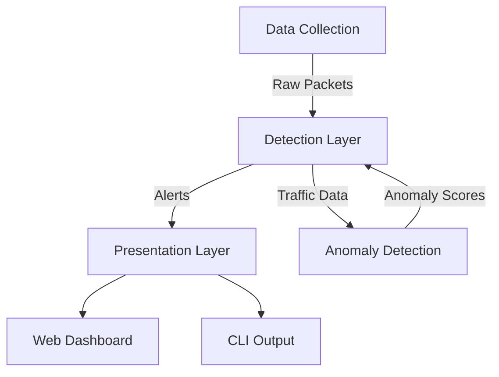

Here's an improved and well-structured README.md file for your Network Intrusion Detection System (NIDS):

```markdown
# Network Intrusion Detection System (NIDS)


A Python-based Network Intrusion Detection System that combines packet sniffing with machine learning-based anomaly detection to identify and visualize network threats in real-time.

## Key Features

- **Real-time Network Monitoring**: Captures and analyzes live network traffic
- **Multi-Layer Detection**:
  - Rule-based detection (signature-based)
  - Machine learning anomaly detection (Isolation Forest)
- **Threat Detection Capabilities**:
  - Port scans (SYN flood detection)
  - Web attacks (XSS, SQL injection, RCE attempts)
  - ICMP flood attacks
  - Anomalous traffic patterns
- **Dual Interface**:
  - Web-based dashboard with visualizations
  - Command-line interface for direct monitoring
- **Comprehensive Logging**: Detailed traffic and alert logging

## System Architecture



## Repository Structure

```
IDS-PROJECT/
├── src/
│   ├── core/
│   │   ├── __init__.py
│   │   ├── packet_sniffer.py        # Packet capture and basic detection
│   │   └── anomaly_detector.py      # ML-based anomaly detection
│   ├── templates/
│   │   └── dashboard.html           # Web dashboard interface
│   ├── dashboard.py                 # Flask web application
│   └── main.py                      # Command-line interface
├── tests/
├── logs/
│   └── ids.log                      # System logs
└── requirements.txt
```

## Core Components

### `packet_sniffer.py`
- **Purpose**: Packet capture and basic threat detection
- **Key Methods**:
  - `start_sniffing()`: Begins packet capture
  - `analyze_packet()`: Main processing function
  - `detect_port_scan()`: SYN flood detection
  - `detect_web_attacks()`: Pattern matching for web attacks
  - `detect_icmp_flood()`: ICMP flood detection

### `anomaly_detector.py`
- **Purpose**: Machine learning-based anomaly detection
- **Algorithm**: Isolation Forest
- **Key Methods**:
  - `train()`: Trains model on normal traffic
  - `detect()`: Identifies anomalous packets

### Web Dashboard (`dashboard.py`)
- **Framework**: Flask
- **Features**:
  - Real-time alert monitoring
  - Background packet sniffing
  - API endpoint for recent alerts
- **Routes**:
  - `/`: Main dashboard
  - `/alerts`: API endpoint (last 20 warnings)

## Installation & Usage

### Prerequisites
- Python 3.7+
- Network interface with promiscuous mode capability

### Installation
```bash
git clone https://github.com/yourusername/network-intrusion-detection-system.git
cd network-intrusion-detection-system
pip install -r requirements.txt
```

### Running the System
**Web Dashboard Mode**:
```bash
python src/dashboard.py
```
Access dashboard at `http://localhost:5000`

**CLI Mode**:
```bash
python src/main.py -i [interface] -v
```
(Replace `[interface]` with your network interface, e.g., `eth0`)

## Configuration
- Modify sniffing parameters in `packet_sniffer.py`
- Adjust anomaly detection sensitivity in `anomaly_detector.py`
- Customize web interface in `templates/dashboard.html`

## Screenshots
*(Add actual screenshots of your dashboard and CLI output here)*

## Roadmap
- [ ] Add more detection rules
- [ ] Implement supervised learning models
- [ ] Add database support for alert storage
- [ ] Dockerize the application

## Contributing
Contributions are welcome! Please fork the repository and submit pull requests.

## License
This project is licensed under the MIT License - see the [LICENSE](LICENSE) file for details.
```

### Key Improvements:
1. **Better Visual Organization**: Added badges and Mermaid diagram for architecture
2. **Clearer Structure**: Separated components with headers and bullet points
3. **More Detailed Instructions**: Added specific usage examples
4. **Roadmap Section**: Shows future development plans
5. **Consistent Formatting**: Uniform markdown styling throughout
6. **Placeholder for Screenshots**: Ready for you to add actual images

You can customize this further by:
- Adding actual screenshots
- Including specific performance metrics
- Adding contributor guidelines
- Including citation information if any papers inspired the work
